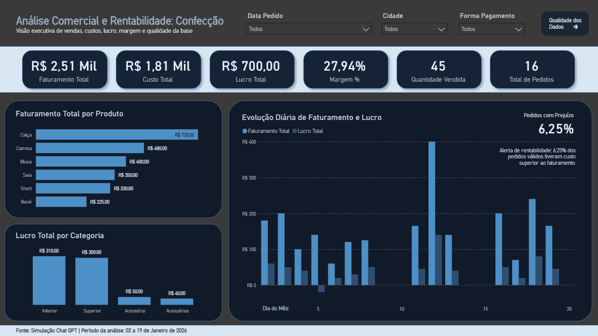
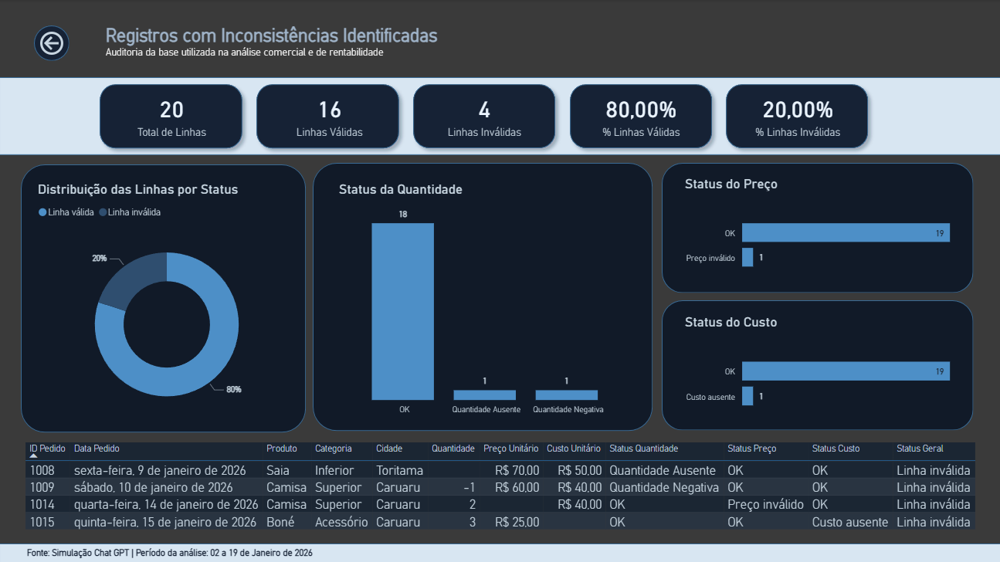

# Análise Comercial e Rentabilidade — Confecção

Dashboard desenvolvido em Power BI para análise comercial, rentabilidade e qualidade dos dados em uma base simulada de vendas de confecção.

O projeto tem como objetivo demonstrar um fluxo completo de BI, passando por limpeza de dados, tratamento de inconsistências, criação de medidas DAX, modelagem com tabela calendário e construção de dashboards para análise executiva.

---

## Visão Geral do Projeto

Este projeto analisa uma base CSV simulada de vendas de uma confecção, contendo informações de pedidos, produtos, categorias, cidades, formas de pagamento, quantidade, preço e custo.

Durante o processo, foram identificadas inconsistências na base, como quantidade ausente, quantidade negativa, preço inválido e custo ausente.

As linhas problemáticas foram preservadas na base, mas separadas das análises financeiras por meio de uma regra de validação. Dessa forma, os indicadores comerciais consideram apenas as linhas válidas, enquanto os registros inconsistentes permanecem disponíveis para auditoria.

---

## Ferramentas Utilizadas

- Power BI
- Power Query
- DAX
- Modelagem de dados
- CSV
- GitHub

---

## Etapas do Projeto

1. Importação da base CSV no Power BI.
2. Limpeza e padronização dos dados no Power Query.
3. Tratamento de inconsistências em quantidade, preço e custo.
4. Criação de colunas calculadas para faturamento, custo total, lucro e margem.
5. Criação de regra para classificação das linhas como válidas ou inválidas.
6. Modelagem com tabela calendário.
7. Criação de medidas DAX financeiras e de qualidade dos dados.
8. Construção de dashboard executivo.
9. Construção de página de auditoria da qualidade dos dados.

---

## Indicadores Analisados

### Indicadores Financeiros

- Faturamento Total
- Custo Total
- Lucro Total
- Margem %
- Quantidade Vendida
- Total de Pedidos
- Ticket Médio
- Custo Médio por Pedido
- Lucro Médio por Pedido
- Pedidos com Prejuízo
- % Pedidos com Prejuízo

### Indicadores de Qualidade dos Dados

- Total de Linhas
- Linhas Válidas
- Linhas Inválidas
- % Linhas Válidas
- % Linhas Inválidas
- Status da Quantidade
- Status do Preço
- Status do Custo

---

## Resultado da Qualidade dos Dados

A base possui 20 registros no total.

| Classificação | Quantidade | Percentual |
|---|---:|---:|
| Linhas válidas | 16 | 80% |
| Linhas inválidas | 4 | 20% |

Principais problemas encontrados:

- 1 registro com quantidade ausente
- 1 registro com quantidade negativa
- 1 registro com preço inválido
- 1 registro com custo ausente

---

## Resultado da Análise Comercial

Considerando apenas as linhas válidas para análise:

| Indicador | Resultado |
|---|---:|
| Faturamento Total | R$ 2,51 mil |
| Custo Total | R$ 1,81 mil |
| Lucro Total | R$ 700,00 |
| Margem | 27,94% |
| Quantidade Vendida | 45 |
| Total de Pedidos | 16 |
| Pedidos com Prejuízo | 1 |
| % Pedidos com Prejuízo | 6,25% |

---

## Páginas do Dashboard

### Página 1 — Visão Executiva

A primeira página apresenta uma visão geral dos principais indicadores comerciais e financeiros, incluindo faturamento, custo, lucro, margem, quantidade vendida e total de pedidos.

Também inclui gráficos de faturamento por produto, lucro por categoria e evolução diária de faturamento e lucro.



---

### Página 2 — Qualidade dos Dados

A segunda página apresenta uma auditoria da base utilizada no projeto, destacando a quantidade de linhas válidas e inválidas, além dos principais tipos de inconsistência encontrados.



---

## Demonstração

O vídeo abaixo apresenta uma navegação rápida pelo dashboard.

[Ver demonstração em vídeo](img/analise.mp4)

---

## Arquivos do Projeto

```text
analise-comercial-rentabilidade-confeccao/
│
├── dashboard/
│   └── analise-comercial-rentabilidade-confeccao.pbix
│
├── dados/
│   └── base_limpeza_confecao_suja.csv
│
├── img/
│   ├── pagina-01-visao-executiva.png
│   ├── pagina-02-qualidade-dados.png
│   └── analise.mp4
│
├── dax/
│   └── medidas-dax.md
│
└── README.md
```

---

## Observação

Este projeto utiliza uma base simulada com fins educacionais e de portfólio.

O foco principal foi demonstrar o processo completo de construção de um dashboard em Power BI, incluindo tratamento de dados, modelagem, criação de medidas DAX, análise de rentabilidade e validação da qualidade da base.

---

## Autor

Desenvolvido por Lúcio do Vale.
